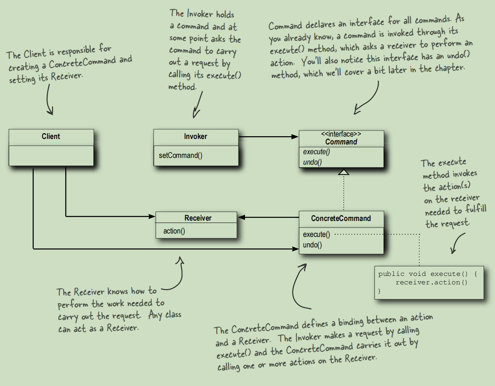

# Command Pattern
The Command Pattern encapsulates a request as an
object, thereby letting you parameterize other objects
with different requests, queue or log requests, and support
undoable operations.

This picture is in the Book ***Head First Design Pattern***.