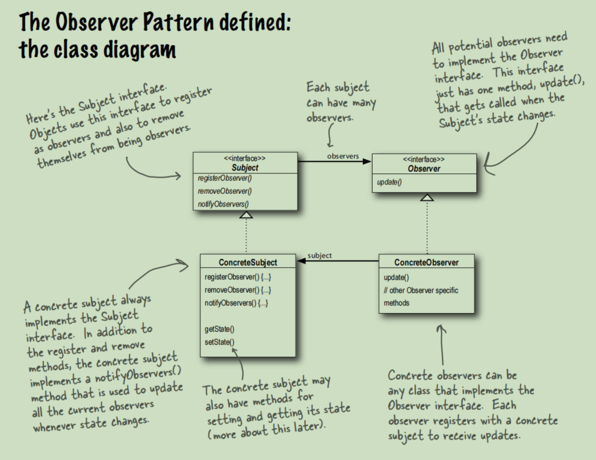

# Observer Pattern 

The Observer Pattern defines a one-to-many
dependency between objects so that when one
object changes state, all of its dependents are
notified and updated automatically.

This picture is in the Book ***Head First Design Pattern***.