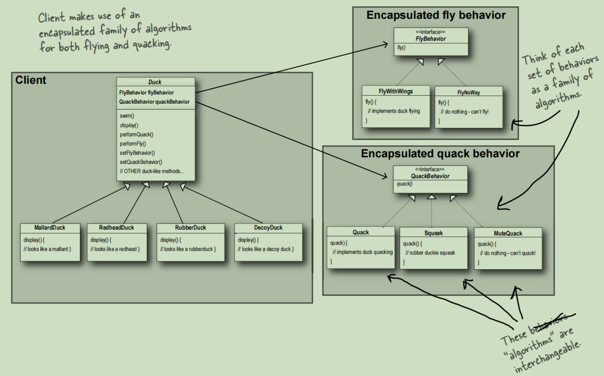

# Strategy Pattern

The Strategy Pattern defines a family of algorithms,
encapsulates each one, and makes them interchangeable.
Strategy lets the algorithm vary independently from
clients that use it.

This picture is in the Book ***Head First Design Pattern***.