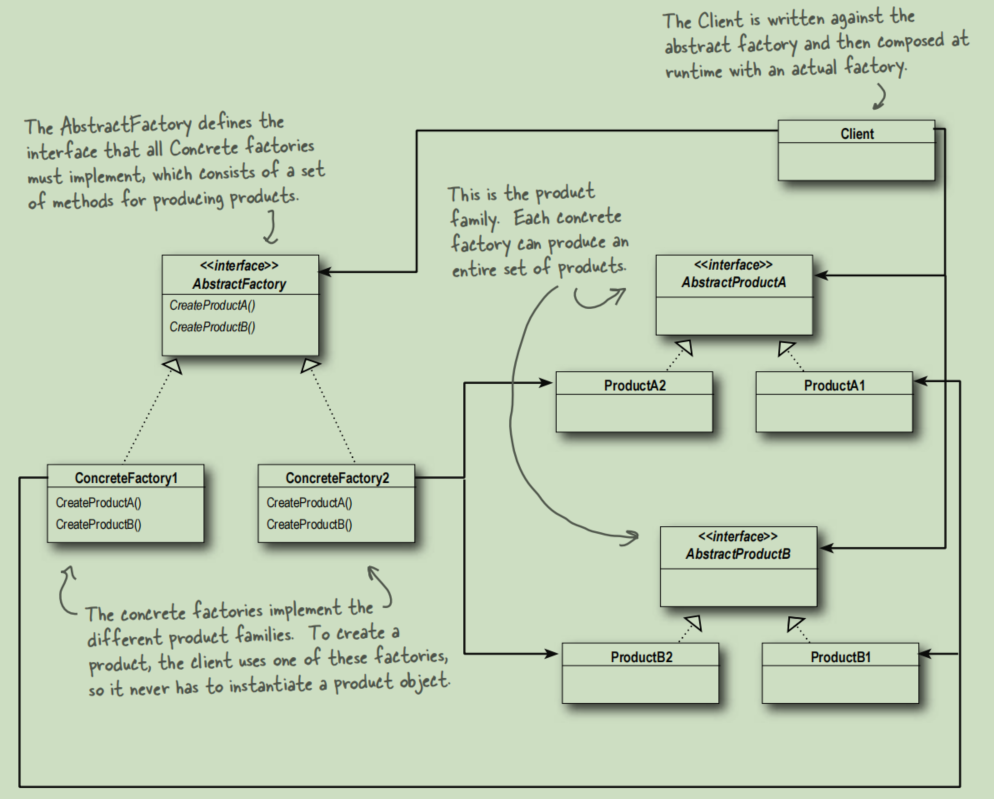

# Abstract Factory

The Abstract Factory Pattern provides an interface
for creating families of related or dependent objects
without specifying their concrete classes.

This picture is in the Book ***Head First Design Pattern***.

