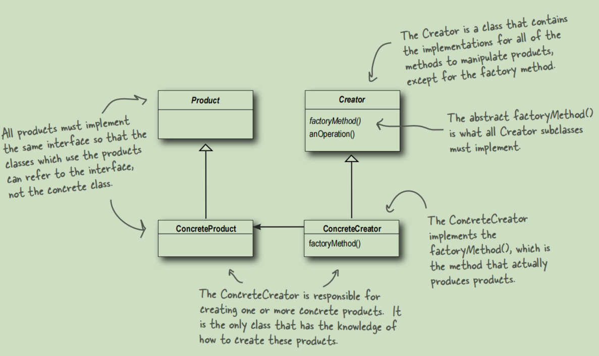

# Factory Pattern

The Factory Method Pattern defines an interface
for creating an object, but lets subclasses decide which
class to instantiate. Factory Method lets a class defer
instantiation to subclasses.

This picture is in the Book ***Head First Design Pattern***.
