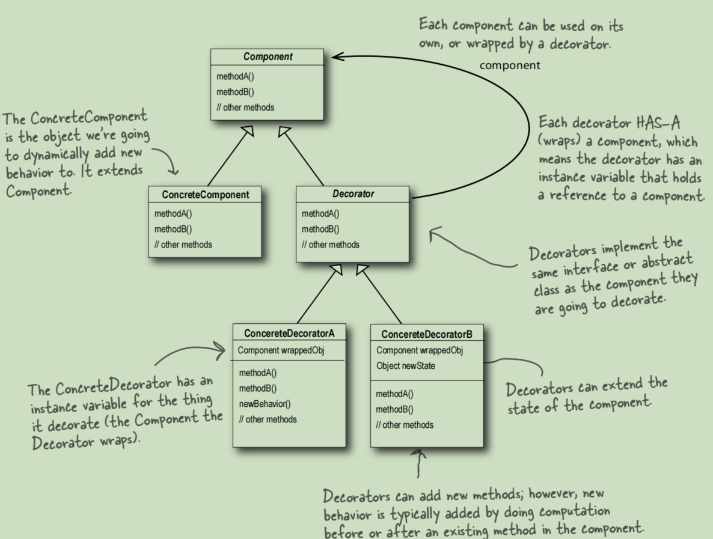

# Decorator Pattern

The Decorator Pattern attaches additional
responsibilities to an object dynamically.
Decorators provide a flexible alternative to
subclassing for extending functionality.

This picture is in the Book ***Head First Design Pattern***.